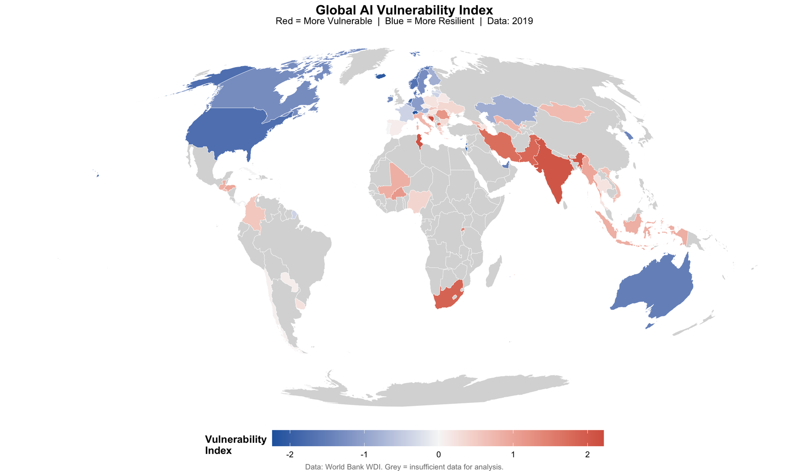
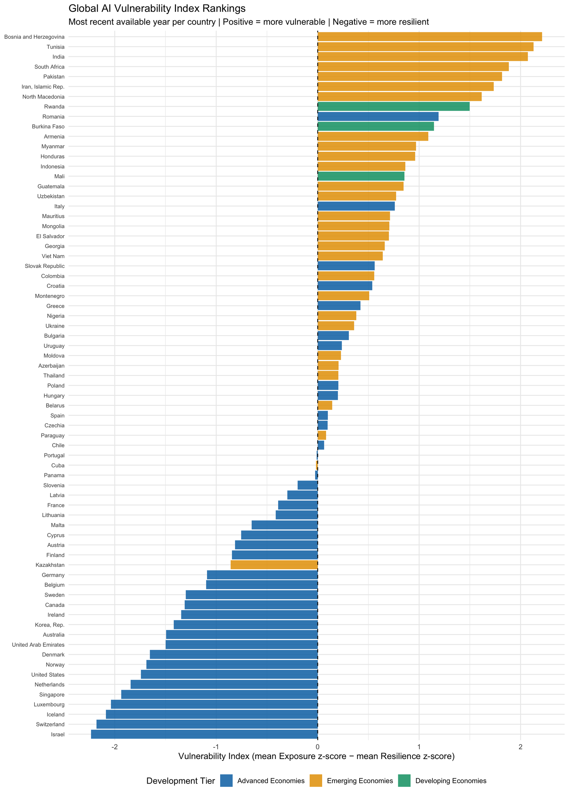
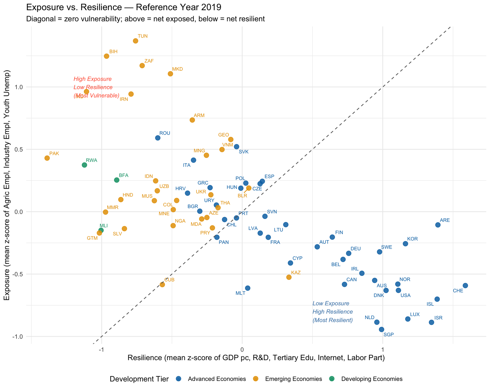
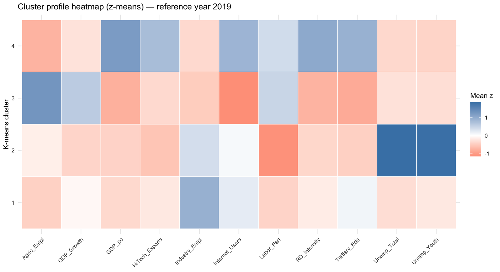
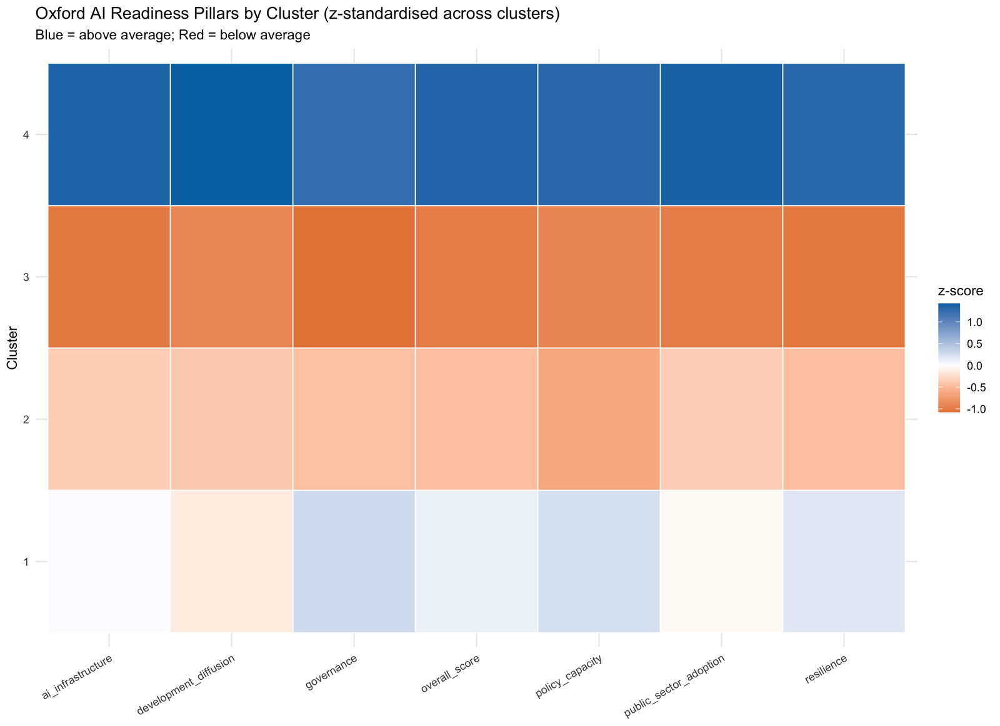

# Which Countries Are Most Vulnerable to AI-Driven Economic Disruption?

**A Global Comparative Analysis — Midterm Project, Advanced Modelling**

Abdullah Tadmuri | Master in Computational Social Science | UC3M | 2025–2026

## Overview

This project identifies which countries are most structurally vulnerable to AI-driven economic disruption using unsupervised learning methods. Eleven structural indicators from the World Bank WDI (2015–2025) are reduced via PCA and classified using three independent clustering methods (K-Means, Hierarchical, Gaussian Mixture). A composite Vulnerability Index is constructed and validated against the Oxford Insights Government AI Readiness Index 2025.

## Key Outputs

- **PCA** on 11 structural indicators (reference-year cross-section)
- **Three clustering methods** with cross-method ARI validation
- **Vulnerability Index** = Exposure - Resilience (z-scored)
- **Sensitivity analysis** (alternative weights, bootstrap CIs)
- **Interactive maps** and temporal trajectory plots
- **External validation** against Oxford AI Readiness Index

## Selected Results

### Global AI Vulnerability Index


### Vulnerability Rankings by Country


### Exposure vs. Resilience


### Cluster Profile Heatmap


### External Validation — Oxford AI Readiness Index


## How to Run

1. Place supplementary CSVs in `data/`:
   - `ai_readiness_index.csv` (Oxford Insights)
   - `global_ai_workforce_automation_2015_2025.csv` (Kaggle)
2. Open `midterm_project_updated.Rmd` in RStudio
3. Click **Knit** (or `rmarkdown::render("midterm_project_updated.Rmd")`)

The first run requires internet access to fetch WDI data; subsequent runs use the disk cache (`data/wdi_2015_2025.rds`).

## Required R Packages

tidyverse, janitor, WDI, countrycode, FactoMineR, factoextra, NbClust, cluster, mclust, psych, dendextend, corrplot, sf, rnaturalearth, rnaturalearthdata, ggrepel, viridis, gridExtra, readxl, knitr, kableExtra, plotly, GGally, ggalluvial, MVN

## Data Sources

| Source | Coverage | Role |
|---|---|---|
| World Bank WDI | 2015–2025, ~200 countries | Primary (11 structural indicators) |
| Oxford Insights | 2025, ~160 countries | External validation |
| Kaggle (synthetic) | 2015–2025 | Illustrative only |

## Project Structure

```
.
├── midterm_project_updated.Rmd    # Main analysis (source of truth)
├── style_updated.css              # Custom HTML styling
├── data/
│   ├── wdi_2015_2025.rds          # Cached WDI panel
│   ├── ai_readiness_index.csv     # Oxford Insights
│   ├── global_ai_workforce_automation_2015_2025.csv  # Kaggle
│   ├── gap_stat.rds               # Cached gap statistic
│   └── nbclust.rds                # Cached NbClust result
├── figures/                       # Key result figures for README
├── .gitignore
└── README.md
```

## License

Academic project — UC3M, 2026.
